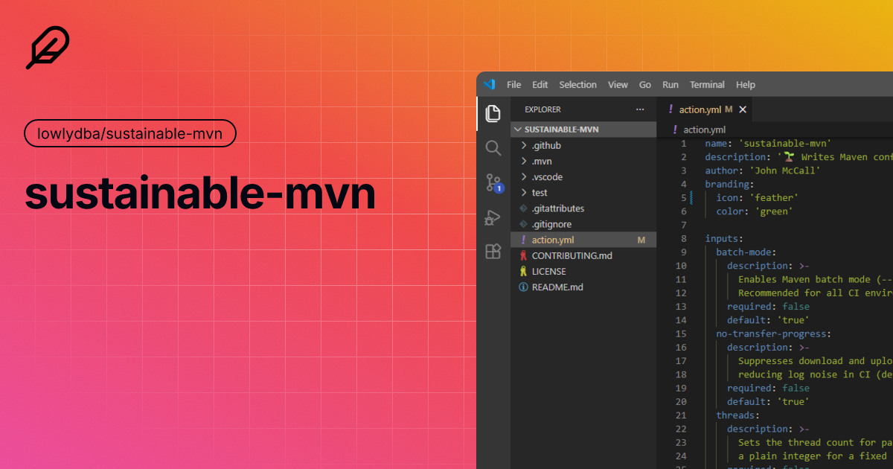

# sustainable-mvn<!-- omit in toc -->

[](https://github.com/lowlydba/sustainable-mvn/actions/workflows/test.yml)
[](https://github.com/lowlydba/sustainable-mvn/actions/workflows/benchmark.yml)
[](https://github.com/lowlydba/sustainable-mvn)




A lightweight GitHub Action that writes sensible Maven defaults to `.mvn/maven.config` to speed up builds and cut unnecessary energy use in CI.

* 🔒 dependency-free
* ⚛️ small size
* 💰 saves time & money
* 🌎 reduces carbon emissions
* :octocat: works with [`actions/setup-java`](https://github.com/actions/setup-java) and all active Java LTS versions

---

- [Usage](#usage)
- [Inputs](#inputs)
- [How It Works](#how-it-works)
- [Performance Benchmarks](#performance-benchmarks)
- [Energy \& Carbon Benchmarks](#energy--carbon-benchmarks)
- [Show Your Support](#show-your-support)

## Usage

After setting up Java with `actions/setup-java`, add this step **before** any Maven commands:

```yaml
jobs:
  build:
    steps:
      - uses: actions/checkout@v4
      - uses: actions/setup-java@v4
        with:
          distribution: temurin
          java-version: '21'
      - uses: lowlydba/sustainable-mvn@v1
      - run: mvn verify
```

To override any defaults:

```yaml
- uses: lowlydba/sustainable-mvn@v1
  with:
    batch-mode: 'true'
    no-transfer-progress: 'true'
    threads: '2C'
    offline: 'false'
    skip-tests: 'false'
    artifact-threads: '8'
    overwrite: 'false'
```

The Maven config is only printed when [debug logging][debug-logging] is enabled (`RUNNER_DEBUG == 'true'`).

## Inputs

| Input | Description | Allowed values | Default |
| --- | --- | --- | --- |
| `batch-mode` | Enable batch mode, disables interactive prompts and ANSI color codes. | `'true'` or `'false'` | `'true'` |
| `no-transfer-progress` | Suppress artifact download/upload progress output. | `'true'` or `'false'` | `'true'` |
| `threads` | Thread count for parallel module builds. `1C` means one thread per CPU core. Empty disables this option. | integer, `1C`, or empty string | `'1C'` |
| `offline` | Fully offline mode. Requires a pre-populated local repository cache. | `'true'` or `'false'` | `'false'` |
| `skip-tests` | Skip test compilation and execution (`-DskipTests`). | `'true'` or `'false'` | `'false'` |
| `artifact-threads` | Parallel threads for downloading artifacts (`-Dmaven.artifact.threads`). | integer | `'8'` |
| `overwrite` | Overwrite an existing `.mvn/maven.config`. When `false`, skip writing if the file exists. | `'true'` or `'false'` | `'false'` |

## How It Works

This action writes a `.mvn/maven.config` file in the repository root. Maven automatically reads this file and applies every line as a CLI argument to each `mvn` invocation — no changes to existing scripts or `pom.xml` files required.

Example generated config with all defaults:

```text
--batch-mode
--no-transfer-progress
--threads 1C
-Dmaven.artifact.threads=8
```

If a `.mvn/maven.config` already exists and `overwrite` is `false` (the default), the action emits a workflow notice and exits without modifying the file.

## Performance Benchmarks

Benchmarks via [hyperfine](https://github.com/sharkdp/hyperfine), 10 runs with 2 warmups on a local Ubuntu runner. The `.mvn/maven.config` written by this action was toggled in/out between runs using `--prepare`, so both commands are identical `mvn` invocations — the only variable is whether the config file is present.

Current CI benchmark fixtures:

- `test/medium-project`: single-module dependency graph (~40 transitive dependencies, all pre-cached locally)
- `test/multi-project`: multi-module reactor graph (`parent + 4 modules`) to exercise Maven parallel module scheduling

### Defaults (`--batch-mode --no-transfer-progress --threads 1C -Dmaven.artifact.threads=8`)

```text
Benchmark 1: mvn dependency:resolve (no config)
  Time (mean ± σ):      2.086 s ±  0.142 s    [User: 5.904 s, System: 1.220 s]
  Range (min … max):    1.949 s …  2.385 s    10 runs

Benchmark 2: mvn dependency:resolve (with sustainable-mvn defaults)
  Time (mean ± σ):      1.940 s ±  0.084 s    [User: 5.816 s, System: 1.129 s]
  Range (min … max):    1.853 s …  2.111 s    10 runs

Summary: sustainable-mvn ran 1.08 ± 0.09 times faster
         — with 41% tighter variance (σ 0.084 s vs 0.142 s)
```

### Extreme mode (defaults + `--offline -DskipTests`)

```text
Benchmark 1: mvn dependency:resolve (no config)
  Time (mean ± σ):      2.243 s ±  0.612 s    [User: 6.310 s, System: 1.272 s]
  Range (min … max):    1.923 s …  3.953 s    10 runs

Benchmark 2: mvn dependency:resolve (with sustainable-mvn extreme mode)
  Time (mean ± σ):      2.078 s ±  0.111 s    [User: 6.130 s, System: 1.162 s]
  Range (min … max):    1.977 s …  2.319 s    10 runs

Summary: sustainable-mvn ran 1.08 ± 0.30 times faster
         — with 82% tighter variance (σ 0.111 s vs 0.612 s)
```

The variance reduction is the headline CI benefit: extreme mode cuts the worst-case outlier from 3.953 s down to 2.319 s, making build times far more predictable.

> [!NOTE]
> Gains grow with project size and are most visible in multi-module builds where `--threads 1C` engages.
> Your actual results will vary based on project structure, network, and hardware.

## Energy & Carbon Benchmarks

Energy and CO₂ estimates are measured on GitHub-hosted runners using [EcoCI](https://github.com/green-coding-solutions/eco-ci-energy-estimation), which reads RAPL CPU energy counters. Three labeled measurements are compared per run: vanilla (no config), sustainable-mvn defaults, and extreme mode.

Results are visible in the [benchmark workflow summary](https://github.com/lowlydba/sustainable-mvn/actions/workflows/benchmark.yml) for each CI run.

## Show Your Support

If this action saves you time or money, consider [sponsoring](https://github.com/sponsors/lowlydba) or [buying a coffee](https://www.buymeacoffee.com/johnmcc).

[debug-logging]: https://docs.github.com/en/actions/monitoring-and-troubleshooting-workflows/troubleshooting-workflows/enabling-debug-logging
